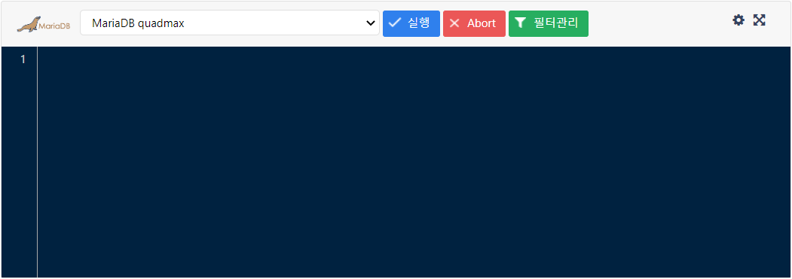
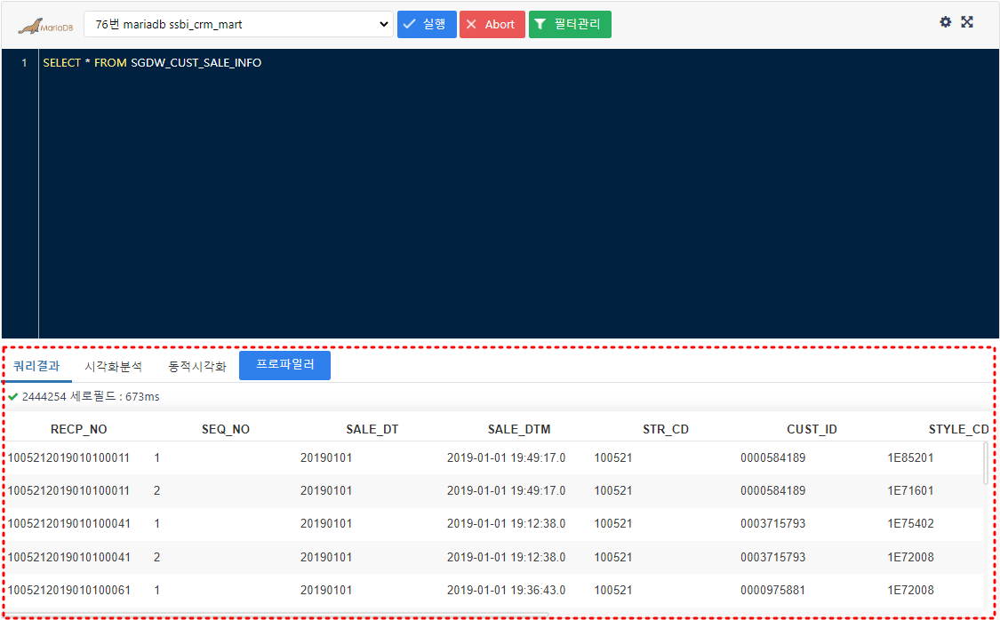
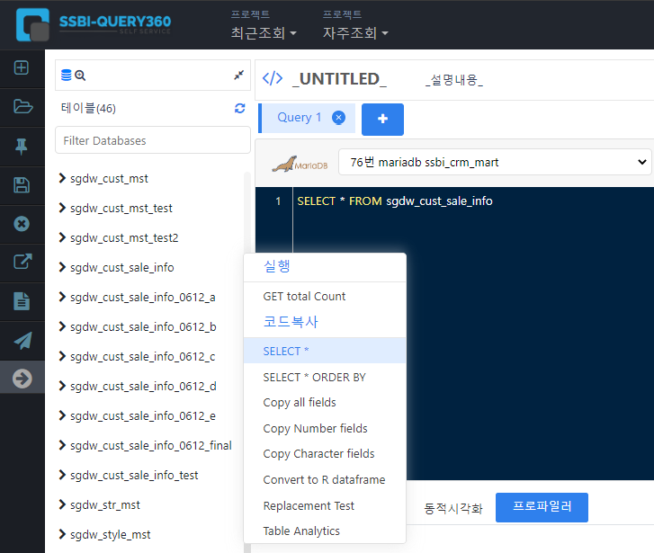
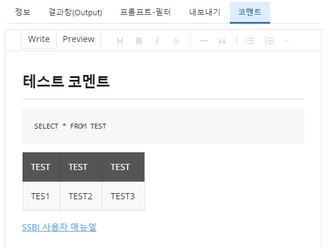
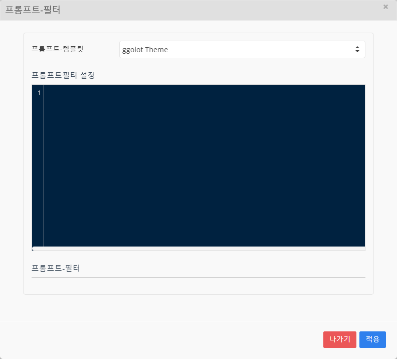
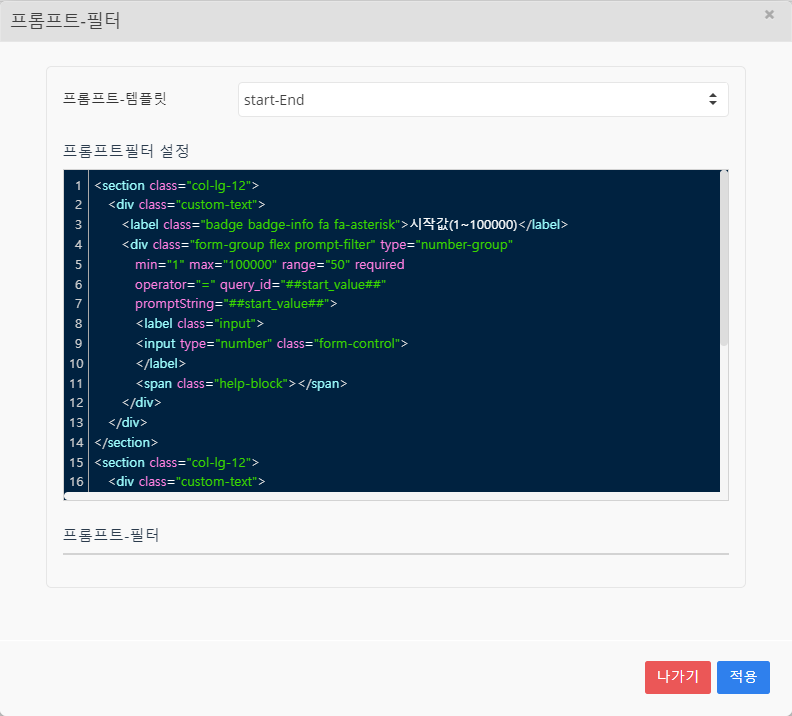
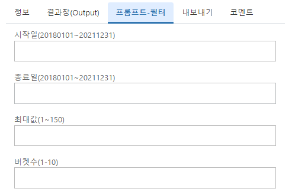
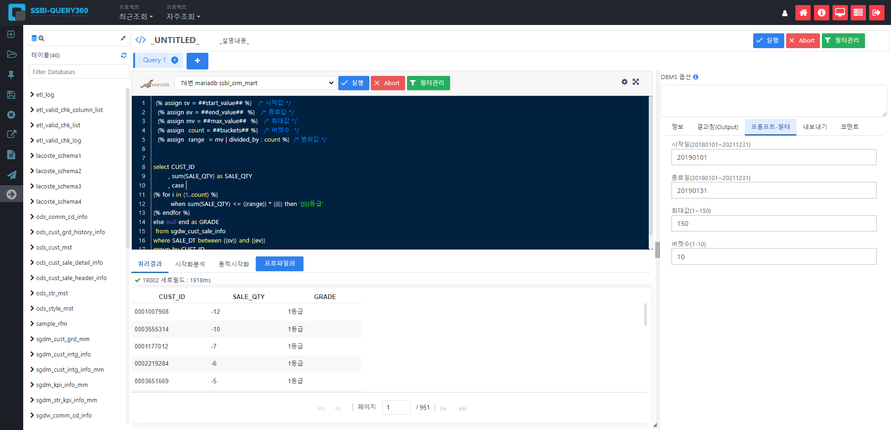

# 프로젝트 시작하기

SSBI-Query 에서의 프로젝트는 데이터를 분석에 맞게 전처리 하여 분석툴로 내보내는 것까지를 의미합니다.

SSBI - PORTAL 로그인 하여 SSBI-Query 를 클릭하여 Query 를 시작해봅시다.

 

   

## 새 프로젝트 만들기

SSBI-Query 에 들어온다면 자동으로 새 프로젝트가 시작됩니다.

Query의 첫화면입니다

 

가장 먼저 해야할 일은 데이터베이스 스키마를 선택하는 것입니다.

다양한 데이터베이스 스키마를 선택할 수 있습니다.

 

샘플로 사용할 데이터가 있는 스키마를 선택하겠습니다. 

76번 마리아DB를 선택

 좌측 메뉴에 해당 스키마에 포함되어있는 테이블이 나오는 것을 볼 수 있으며,테이블 클릭시 테이블에 포함된 칼럼들 역시 볼 수 있습니다.

또한, 테이블이나 칼럼을 우클릭한다면 테이블이나 칼럼에 대한 간단한 정보나 요약을 우측 결과창에서 볼 수 있고 혹은 간단한 쿼리문을 Editor창에 바로 입력 할 수 있습니다.   

컬럼의 간단한 정보를 조회 할 수 있습니다.

   

## 쿼리 작성하기

### 에디터 작성

데이터베이스 스키마를 선택했다면 해당 데이터베이스에서 원하는 데이터만 추출하기 위해서 에디터를 작성해야 합니다. 

에디터 창

 

Editor창에 SQL 쿼리를 입력하고 실행 버튼을 눌리면 됩니다.
간단하게 하나의 테이블을 조회해보겠습니다.

~~~ sql
SELECT * FROM SGDW_CUST_SALE_INFO 
~~~

 

에디터 아래 쿼리결과에 테이블을 조회한 결과를 볼 수 있습니다.

 

쿼리는 직접 손으로 입력 할 수도 있지만, 좌측 필드영역에서 드래그앤드롭으로 테이블이나 칼럼명을 입력 할 수 있고, 우클릭에 나오는 메뉴를 통해 간단한 쿼리를 바로 입력 할 수도 있습니다.

 

한번의 클릭으로 SELECT * FROM sgdw_sale_info 쿼리가 입력되었습니다.

 

~~~ note
우클릭에서 나오는 메뉴는 SSBI Config Manager CODESUPPORT 에서 변경 할 수 있습니다.
~~~

 

이제 본격적으로 쿼리를 작성해보겠습니다. 

샘플데이터에서 2019년 매출정보에 고객정보와 상품정보를 JOIN 하여 고객번호, 매출날짜, 성별, 연령대, 고객등급, 옷의종류 별로 매출수량과 매출금액을 조회 해보겠습니다.

~~~ sql
select *
  from sgdw_cust_sale_info a
       left outer join sgdw_cust_mst b
    on a.CUST_ID = b.CUST_ID
       left outer join sgdw_style_mst c
    on a.STYLE_CD = c.STYLE_CD
 where a.SALE_DT between '20190101' and '20191231'
~~~

매출정보(`sgdw_cust_sale_info `) 테이블에 고객정보(`sgdw_cust_mst)` 테이블과 상품정보(`sgdw_style_mst `) 테이블을 조인시켰습니다.

~~~sql
select *
  from sgdw_cust_sale_info a
       left outer join sgdw_cust_mst b
    on a.CUST_ID = b.CUST_ID
       left outer join sgdw_style_mst c
    on a.STYLE_CD = c.STYLE_CD
------------------변경 부분--------------------------
       left outer join sgdw_comm_cd_info d
    on b.GENDER_CD = d.CD
   and d.DIV_CD = 'CM101'
       left outer join sgdw_comm_cd_info d0
    on b.AGE_ARP_CD = d0.CD
   and d0.DIV_CD = 'CM102'
       left outer join sgdw_comm_cd_info d1
    on b.CUST_GRD_CD = d1.CD
   and d1.DIV_CD = 'CM103'
       left outer join sgdw_comm_cd_info d2
    on c.ITEM_DIV_CD = d2.CD
   and d2.DIV_CD = 'SY101'
-----------------------------------------------------
 where a.SALE_DT between '20190101' and '20191231'
~~~

코드로 되어있는 고객정보와 상품정보를 변환시키기 위해 코드정보(`sgdw_comm_cd_info `) 테이블을 추가적으로 조인했습니다.

 

~~~sql
------------------변경 부분--------------------------
select a.CUST_ID as MBR_NO
     , a.SALE_DT
     , a.SALE_QTY
     , a.SALE_AMT
     , ifnull(d.CD_NM,'미정의') as Sex
     , ifnull(d0.CD_NM,'미정의') as Age
     , ifnull(d1.CD_NM,'미정의') as Grade
     , ifnull(d2.CD_NM,'미정의') as Clothes
-----------------------------------------------------
  from sgdw_cust_sale_info a
       left outer join sgdw_cust_mst b
    on a.CUST_ID = b.CUST_ID
       left outer join sgdw_style_mst c
    on a.STYLE_CD = c.STYLE_CD
       left outer join sgdw_comm_cd_info d
    on b.GENDER_CD = d.CD
   and d.DIV_CD = 'CM101'
       left outer join sgdw_comm_cd_info d0
    on b.AGE_GRP_CD = d0.CD
   and d0.DIV_CD = 'CM102'
       left outer join sgdw_comm_cd_info d1
    on b.CUST_GRD_CD = d1.CD
   and d1.DIV_CD = 'CM103'
       left outer join sgdw_comm_cd_info d2
    on c.ITEM_DIV_CD = d2.CD
   and d2.DIV_CD = 'SY101'
 where a.SALE_DT between '20190101' and '20191231'
~~~

마지막으로 필요한 정보를 각 테이블에서 SELECT 하였습니다. Null 값이 있을 경우 ifnull을 이용해  ‘미정의’ 로 정의 하기로 하고 Alias를 설정해주면 쿼리가 완성되었습니다.

 

완성된 쿼리를 실행하면, 원하는 데이터가 나온 것을 볼 수 있습니다.

고객코드, 매출일, 성별, 연령대, 등급, 복종 별 매출수량 및 매출금액

  

### 코멘트 작성

에디터 작성 중에 해당 프로젝트에 대한 메모를 하고 싶을때 코멘트 기능을 사용할 수 있습니다.

Wirte모드에서 작성하고 프로젝트를 저장한다면 코멘트도 함께 저장되며 Preview모드에서 볼 수 있습니다.

위의 메뉴를 통해 리스트나 이미지, 링크 등 다양한 형태의 코멘트를 삽입할 수 있습니다.

   

## 프롬프트 필터

2019년 1월의 구매수량 30개에 따라 고객별 등급을 나누는 쿼리를 만들어본다면

~~~ sql
SELECT CUST_ID
     , sum(SALE_QTY) as SALE_QTY
	 , case when sum(SALE_QTY) <= 30 then 1
	        when sum(SALE_QTY) <= 60 then 2
	        when sum(SALE_QTY) <= 90 then 3
	  	    when sum(SALE_QTY) <= 120 then 4
		    when sum(SALE_QTY) <= 150 then 5
		    else null end as GRADE
  FROM sgdw_cust_sale_info
 WHERE SALE_DT between 20190101 and 20190131 
 GROUP by CUST_ID
 ORDER by 2
~~~

이런 쿼리를 만들 수 있습니다.

쿼리를 작성하려고 한다면 기본적인 SQL을 알아야 하지만
프롬프트 필터는 쿼리를 잘 모르는사람도 QUERY-360을 사용 할 수 있도록 설정해줄 수 있습니다.

먼저 우측 정보창의 필터관리를 클릭하여

프롬프트 필터 설정창

프롬프트필터를 설정할 수 있는 창이 나오는데 HTML을 입력하여 프롬프트 필터를 만들 수 있습니다. 상단의 프롬프트-템플릿의 다양한 예시를 응용하여 새로운 프롬프트 필터를 만들 수 도 있습니다. 

프롬프트 필터를 작성하고(위), 적용한모습(아래)

 

프롬프트 필터의 값을 입력할 수 있는 텍스트박스가 생성이 됩니다.
이렇게 입력된 값을 활용하여, SQL을 작성할 수도 있습니다.

 

~~~ sql
SELECT CUST_ID
       , sum(SALE_QTY) as SALE_QTY
	   , case 

        when sum(SALE_QTY) <= {{range}} * {{i}} then '{{i}}등급'

else null end as GRADE
 FROM sgdw_cust_sale_info
WHERE SALE_DT between {{sv}} and {{ev}}
GROUP by CUST_ID
ORDER by 2
~~~

 

상위 5줄은 Prompt_filter로 받은 변수를 정의해주는 Liquid 입니다.
8줄 부터 Liquid의 반복문과 변수를 활용하여 쿼리를 만들었습니다.

프롬프트 입력값을 받아서 쿼리결과가 조회되는 것을 볼 수 있습니다.

 

쿼리를 잘 모르는 사람도 준비된 쿼리에 프롬프트 필터의 입력 값을 변경하여 결과를 조회 할 수 있습니다.

   

## 프로젝트 관리

작업된 코드의 결과를 프로젝트로 저장하고 열람할 수 있게 함으로써, 다른사람과 공유하고 확인할 수 있습니다.

좌측 네비게이션 바의 프로젝트 저장을 눌러 작업한 프로젝트를 저장할 수 있습니다.

 

