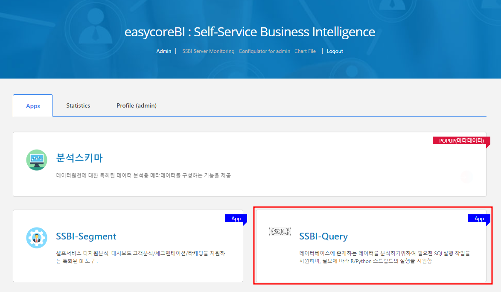
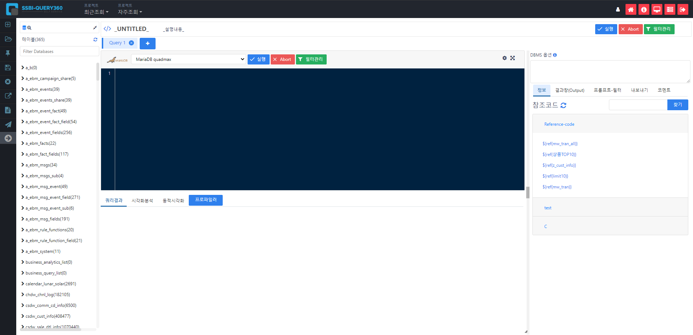
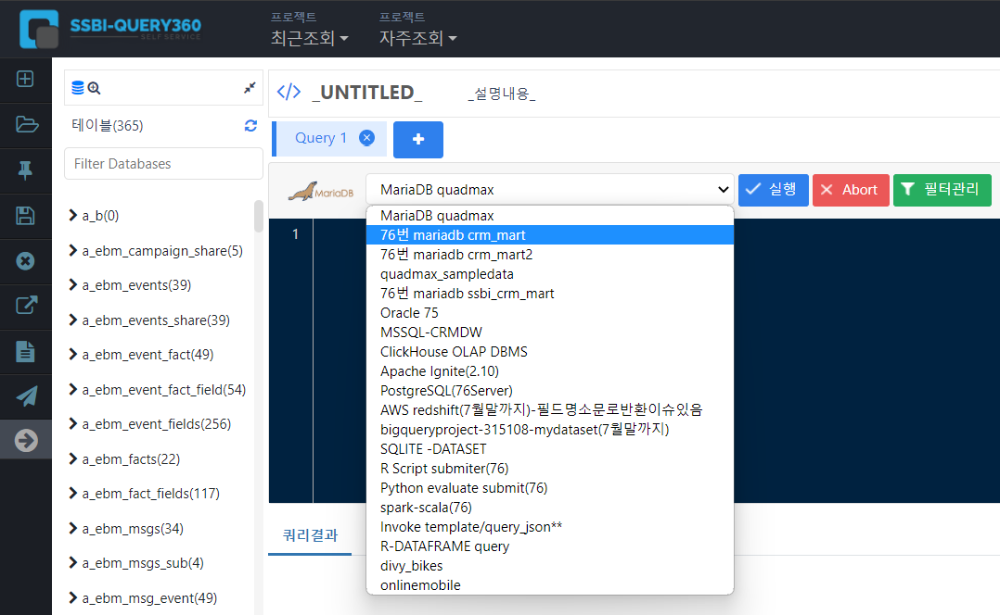
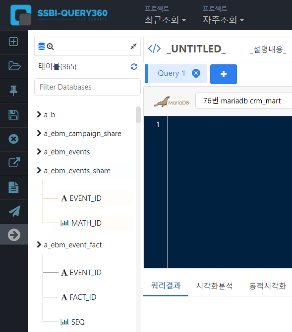

# 프로젝트 시작하기

SSBI-Query 에서의 프로젝트는 데이터를 분석에 맞게 전처리 하여 분석툴로 내보내는 것까지를 의미합니다.

SSBI - PORTAL 로그인 하여 SSBI-Query 를 클릭하여 Query 를 시작해봅시다.

  

   

## 새 프로젝트 만들기

SSBI-Query 에 들어온다면 자동으로 새 프로젝트가 시작됩니다.

Query의 첫화면입니다

   

가장 먼저 해야할 일은 데이터베이스 스키마를 선택하는 것입니다.

다양한 데이터베이스 스키마를 선택할 수 있습니다.

   

샘플로 사용할 데이터가 있는 스키마를 선택하겠습니다. 

76번 마리아DB를 선택</fornt>

