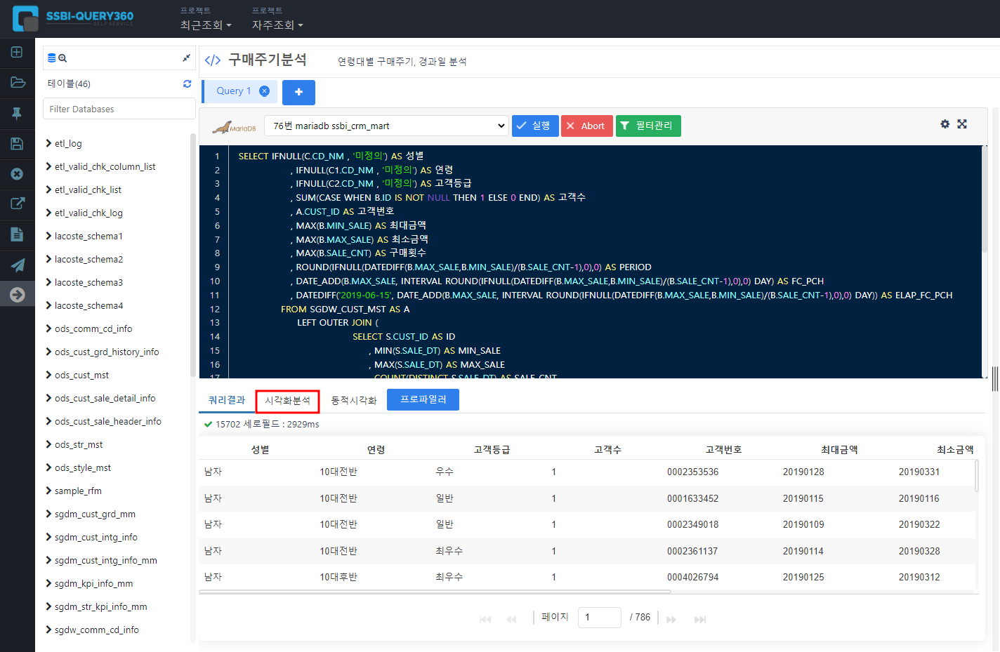
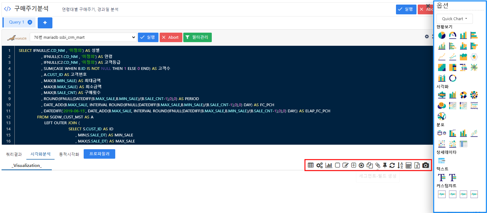
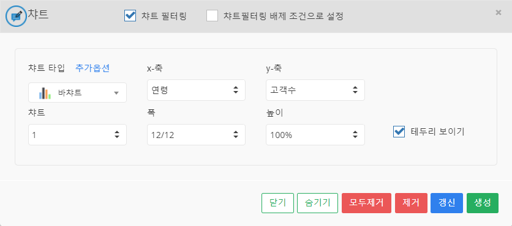

# 차트 만들기

QUERY-360은 데이터 전처리가 주목적이지만 데이터를 간단한 차트로 한눈에 볼 수 있는 기능도 있습니다.

   

## 테이블 대시보드

에디터를 통해 쿼리를 작성하여 데이터를 테이블 형식으로 추출하였습니다.

테이블의 정보를 한눈에 보려면 차트로 만드는 것이 필수적입니다.

SSBI-Query 에서도 간단하게 차트를 만들어 데이터의 대략적인 정보를 파악 할 수 있습니다.

 

테이블 형식으로 추출된 데이터

쿼리결과 옆 시각화 분석을 눌러서 간단하게 차트를 만들 수 있습니다.

 

우측에 퀵차트메뉴(파란박스)와 차트툴(빨간박스)

 

퀵차트는 별다른 설정없이 간단하게 차트를 만드는 기능입니다.
차트툴은 차트를 사용자의 설정으로 만드는 기능입니다.

차트생성으로 눌러 팝업창을 띄우고 만들고 싶은 차트 타입을 선택하고 X축에 들어갈 칼럼과 Y축에 들어갈 칼럼을 선택합니다. 이때 문자 값은 X축, 수치 값은 Y축에만 들어 갈 수 있으니 쿼리를 작성할 때 타입을 잘 설정 해주어야 합니다. 

바차트를 만들어 연령대별 고객수를 간단하게 확인해 보겠습니다.

 

X축에는 연령, Y축에는 고객수를 선택

차트의 크기를 적당하게 선택하고 생성을 눌린다면 새로운 차트가 생성됩니다.

차트를 우클릭하여 차트 설정 옵션으로 다양하게 차트를 꾸밀수 있습니다.

