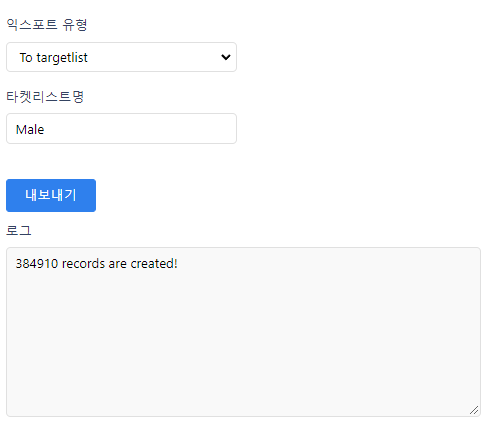
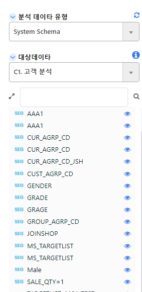

# 데이터 내보내기

이전 장에서 차트를 만들어 보았지만 조금 더 디테일한 차트나 스토리보드를 만들기 위해서는 SEGMENT-360같은 다른 프로그램으로 데이터를 보낼 수 있어야 합니다.

<br><br><br>

## Targetlist 내보내기

Targetlist로 보내기는 SSBI-Query에서 SSBI-Segment 항목으로 사용하고 싶을때 내보내는 방법입니다.

Targetlist로 내보낸 세그먼트는 System Schema, My Schema, My Tables 에서 모두 사용 할 수 있습니다.

Targetlist는 고유한 하나의 값만 가져야 합니다.

<br>

~~~sql
select A.MBR_NO
from
(
  select a.CUST_ID as MBR_NO
      , a.SALE_DT
      , a.SALE_QTY
      , a.SALE_AMT
      , ifnull(d.CD_NM,'미정의') as Sex
      , ifnull(d0.CD_NM,'미정의') as Age
      , ifnull(d1.CD_NM,'미정의') as Grade
      , ifnull(d2.CD_NM,'미정의') as Clothes
    from sgdw_cust_sale_info a
        left outer join sgdw_cust_mst b
      on a.CUST_ID = b.CUST_ID
        left outer join sgdw_style_mst c
      on a.STYLE_CD = c.STYLE_CD
        left outer join sgdw_comm_cd_info d
      on b.GENDER_CD = d.CD
    and d.DIV_CD = 'CM101'
        left outer join sgdw_comm_cd_info d0
      on b.AGE_GRP_CD = d0.CD
    and d0.DIV_CD = 'CM102'
        left outer join sgdw_comm_cd_info d1
      on b.CUST_GRD_CD = d1.CD
    and d1.DIV_CD = 'CM103'
        left outer join sgdw_comm_cd_info d2
      on c.ITEM_DIV_CD = d2.CD
    and d2.DIV_CD = 'SY101'
  where a.SALE_DT between '20190101' and '20191231'
) A
where A.Sex = '남자'
~~~

<br>

기존의 쿼리를 서브쿼리로 하여 남자인 고객들만 추출하였습니다.

그 후 오른쪽 내보내기를 클릭하여 익스포트 유형을 To tagetlist로 하고 적절한 타겟리스트명을 입력한 뒤 내보내기를 클릭합니다.

<br>

<center></center>

<p align="center"><font size="2m">로그에 레코드가 만들어졌다면, 내보내기 완료</font></p>

<br>

내보내기에 성공했다면 총 몇건의 데이터가 타겟팅 되었는지 로그에 뜨게 됩니다.

<br>

<center></center>

<p align="center"><font size="2m">Male 세그먼트가 추가된 것을 볼 수 있습니다</font></p>

<br>

SEGMENT-360의 System Schema나 My Schema, My Tables 에서 사용할 수 있는 Target Segment에 Male이 있는 것을 볼 수 있습니다.

<br><br><br>

## SQLITE Dateset 으로 보내기

SQLITE Dataset으로 보내기는 SEGMENT-360의 데이터셋 테이블로 활용하거나 QUERY-360에서의 SQLITE-DATASET에서 활용하고 싶을때 내보내는 방법입니다.  

<br>

```warning
SQLITE Dataset으로 보낼때는 Liquid문이 적용이 안되서 Liquid문이 없는 쿼리로 바꿔주어야 합니다.
```

<br>

우측의 내보내기에서 익스포트 유형을 To SQLITE Dataset 으로 변경해주고 적절한 데이터셋 명을 입력한 뒤 내보내기를 클릭합니다.
