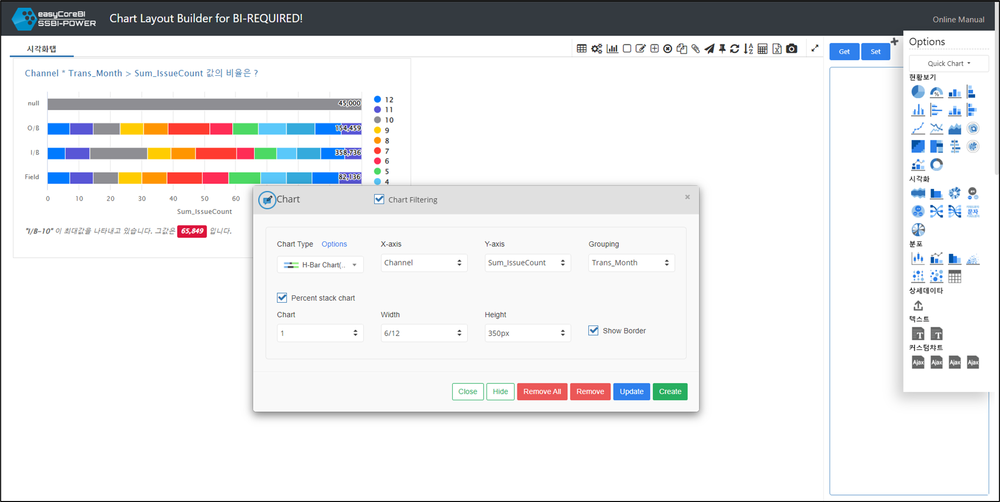

# Layout Builder 주요기능

 
 

Layout Builder 는 크게 2가지의 기능으로 나뉘어져 있습니다. 

1. 차트를 사용자화하여 구성하는 기능 
2. 구성된 차트 레이아웃을 JSON 형태로 내보내는 기능 

2가지를 통해서 구성된 차트레이아웃을 "BI-REQUIRED!"  의 설정파일을 적용하여 사용할 수 있습니다.

 
 

## 1. 차트 사용자화 하기

차트툴을 사용하여 다양한 차트를 사용자화 하여 구성할 수 있습니다.  

크기, 색상, 관점등 세부옵션을 설정할 수도 있고, 퀵차트 메뉴를 통해 빠른 차트 구성이 가능합니다 

<a href="file2.html#차트툴">차트툴 사용법 바로가기</a>를 통해 차트 구성을 시작해보세요!  

 
 

## 2. 차트 레이아웃 추출하기
