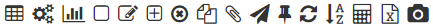
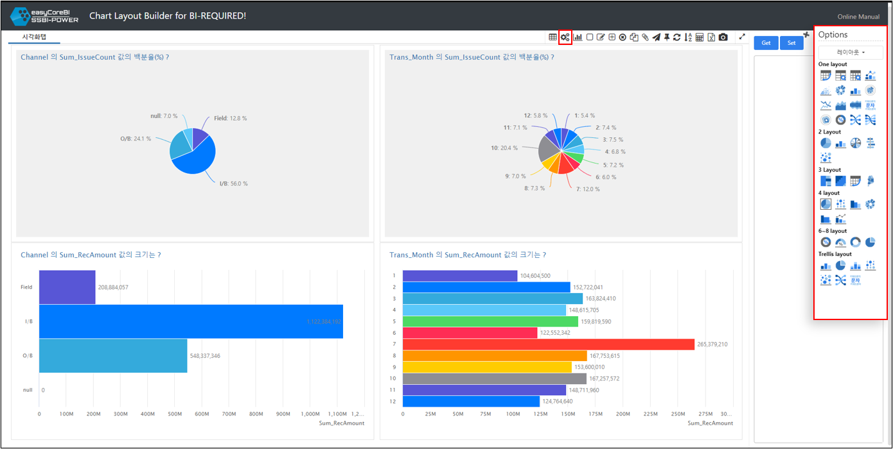
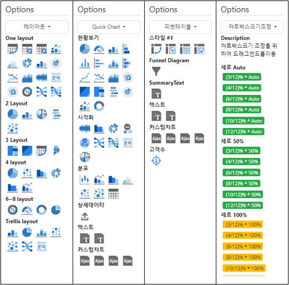

# Layout Builder 기능

---

Chart Layout Builder 의 상세기능에 대해서 알아 봅시다.
 상세기능을 알아보기전 간단하게 화면에 대해 알아보겠습니다.

   

---

## 화면설명

우측상단의 차트툴로 다양한 차트를 사용자에 맞게끔 설정할 수 있고, 우측에는 레이아웃빌더의 기능의 핵심인 대시보드 레이아웃을 JSON 형태로 추출되는 코드박스가 있습니다.

우측 상단의 차트툴로 대시보드를 설정하고, 우측에는 설정한 대시보드 레이아웃을 JSON 형태로 가져올 수 있는 코드박스가 있습니다.

 

## 차트툴

 

다양한 차트툴 기능으로 대시보드를 사용자화 할 수 있습니다.

 

### 1. 퀵차트

 

퀵차트 기능에서는 다양한 옵션으로 차트 또는 위젯을 빠르게 구성할 수 있습니다.

 레이아웃 : 레이아웃에 맞게 차트가 구성됩니다.
 퀵차트  : 주제에 맞는 차트를 구성합니다.
 피벗테이블 : 피벗테이블을 구성합니다.
 비즈니스 KPI, 추천항목, 타케팅분석 : 등록된 위젯을 대시보드에 구성합니다.
 차트박스크기조절 : 미리등록된 차트박스크기를 차트에 드래그앤 드롭하여 차트의 크기를 쉽게 조정할 수 있습니다.

 

레이아웃, 퀵차트, 피벗테이블, 차트박스크기조절 옵션

 
