# Layout Builder 기능

---

Chart Layout Builder 의 상세기능에 대해서 알아 봅시다.
 상세기능을 알아보기전 간단하게 화면에 대해 알아보겠습니다.

   

---

## 화면설명

우측상단의 차트툴로 다양한 차트를 사용자에 맞게끔 설정할 수 있고, 우측에는 레이아웃빌더의 기능의 핵심인 대시보드 레이아웃을 JSON 형태로 추출되는 코드박스가 있습니다.

우측 상단의 차트툴로 대시보드를 설정하고, 우측에는 설정한 대시보드 레이아웃을 JSON 형태로 가져올 수 있는 코드박스가 있습니다.

 

## 차트툴

 

다양한 차트툴 기능으로 대시보드를 사용자화 할 수 있습니다.

 

### 1. 퀵차트

 

퀵차트 기능에서는 다양한 옵션으로 차트 또는 위젯을 빠르게 구성할 수 있습니다.

 레이아웃 : 레이아웃에 맞게 차트가 구성됩니다.  퀵차트  : 주제에 맞는 차트를 구성합니다. 
 피벗테이블 : 피벗테이블을 구성합니다. 
 비즈니스 KPI, 추천항목, 타케팅분석 : 등록된 위젯을 대시보드에 구성합니다. 
 차트박스크기조절 : 미리등록된 차트박스크기를 차트에 드래그앤 드롭하여 차트의 크기를 쉽게 조정할 수 있습니다.

 

레이아웃, 퀵차트, 피벗테이블, 차트박스크기조절 옵션

 

### 2. 차트생성

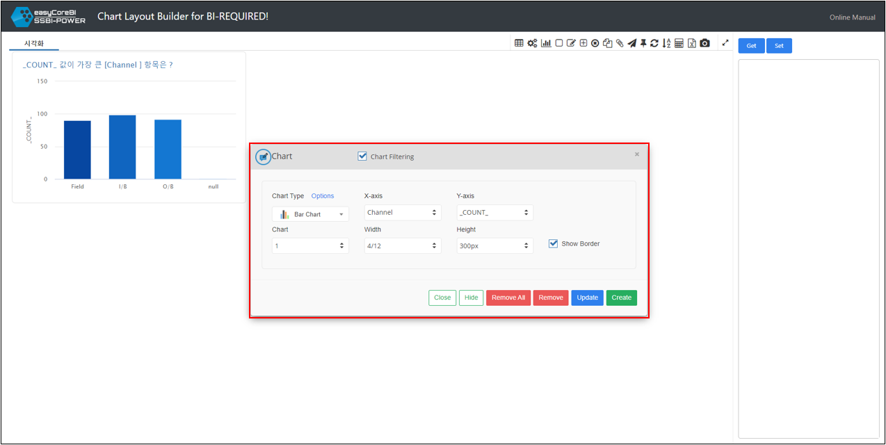

차트생성을 통해서 사용자가 원하는 대시보드와 관점으로 차트를 만들 수 있습니다.

   1. 차트 필터링 : 생성된 차트에서, 필터의 기능 활성화 / 비활성화 
   2. 차트 형태 선택 
   3. X축, Y축 등 분석 필드 설정 
   4. 차트 순서 설정 ( 대시보드에 다수의 차트가 존재할 때 사용합니다 ) 
   5. 차트 넓이 
   6. 차트 높이 
   7. 경계선 표시 여부

 

### 3. 차트초기화

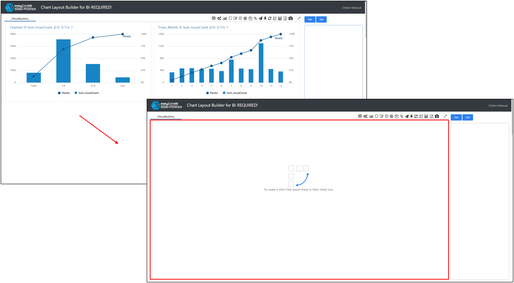

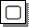   차트 초기화 : 생성된 차트들을 모두 삭제하여 하단 대시보드를 전부 없애고, 초기화합니다.

 

### 4. 탭수정

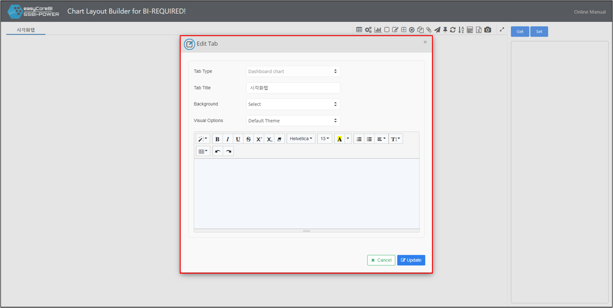

시각화탭을 수정합니다. 테마, 또는 이름 배경색상을 바꿀수 있습니다.

1. 시각화탭 타입 표시
2. 탭 이름 설정
3. 탭 배경 설정
4. 탭 테마 설정
5. 탭에 포함될 텍스트 작성

 

### 5. 신규 탭 & 탭삭제

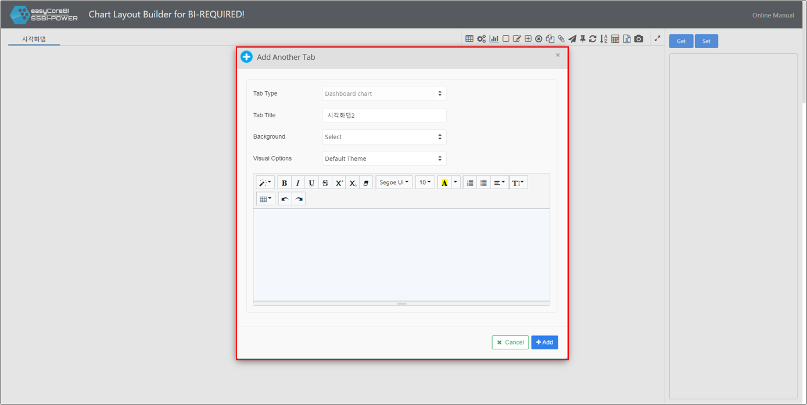

   신규탭 : 대시보드에 새 탭을 추가합니다. 탭 수정과 기능은 같습니다. 

   탭삭제 : 테이블 대시보드의 탭을 삭제할 수 있는 기능입니다. 

 

### 6. 탭복제

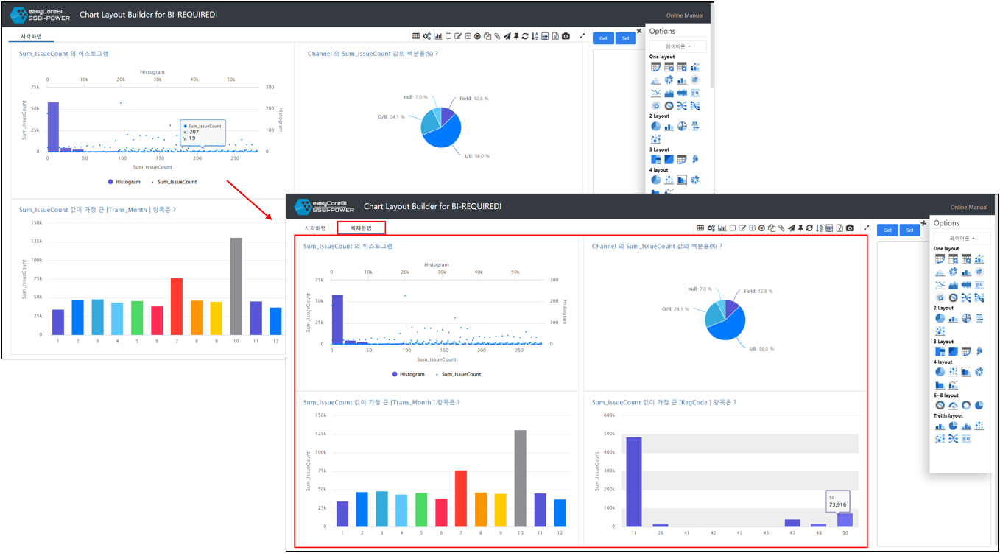

탭을 복제하면 기존의 대시보드설정까지 전부 복제됩니다.
   

  탭복사 : 현재 작업중인 탭을 복사합니다.  

 

### 7. 메모기능

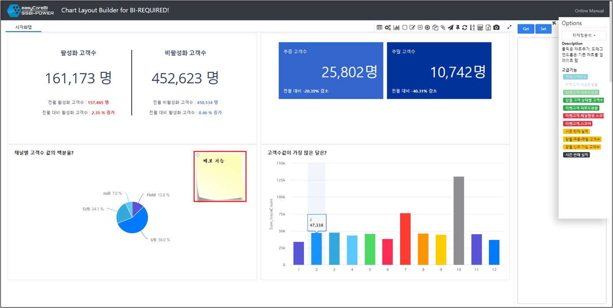

   메모 : 현재 작업중인 탭에 포스트잇 형태의 메모를 추가 할 수 있습니다. 

 

### 8. 차트필터링 해제

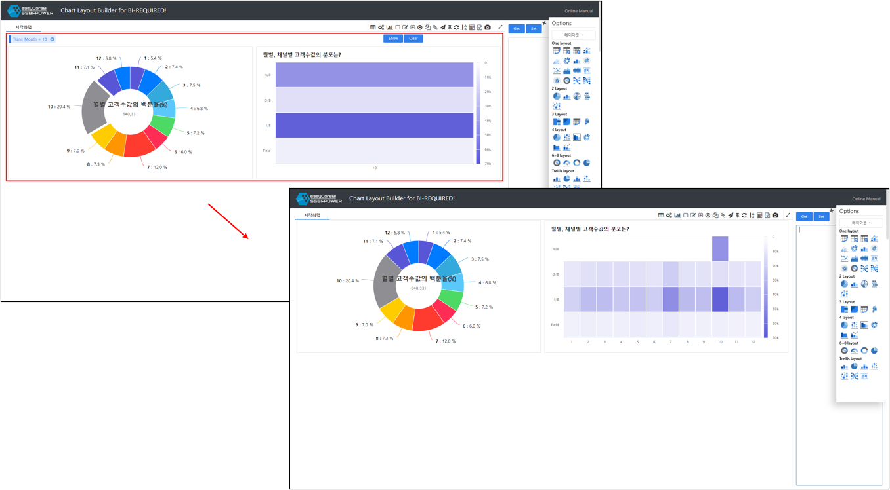

1. 차트필터링 조건
2. 필터링 전의 차트

차트필터링 해제 : 시각화 탭에서 사용한 필터들을 일괄 삭제 합니다. 아이콘 또는 내용지우기 버튼을 눌러서 적용된 차트필터링( 1 )을 해제하여 기존의 필터링이 적용 되지 않은 차트( 2 )로 돌아갈 수 있습니다.

 

### 9. 정렬

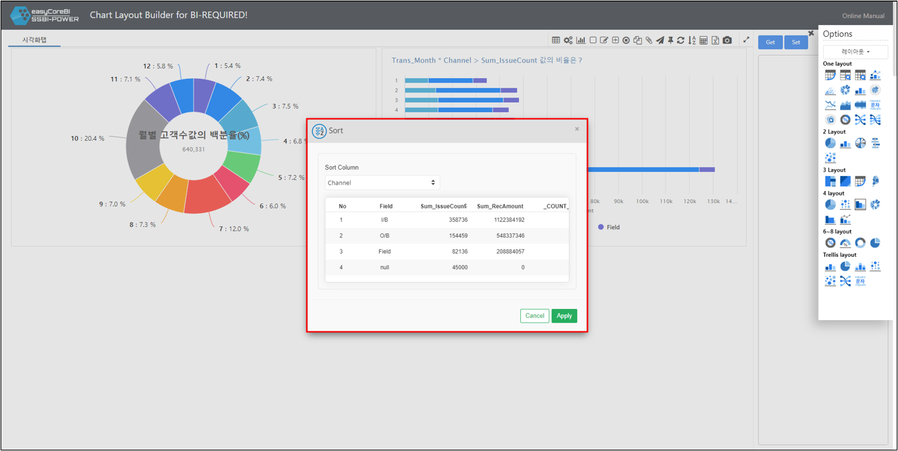

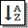   정렬 : 추출한 컬럼을 선택하여 정렬할 수 있습니다. 정렬 순서를 편집하면 차트에도 반영됩니다.

 

### 10.계산값필드

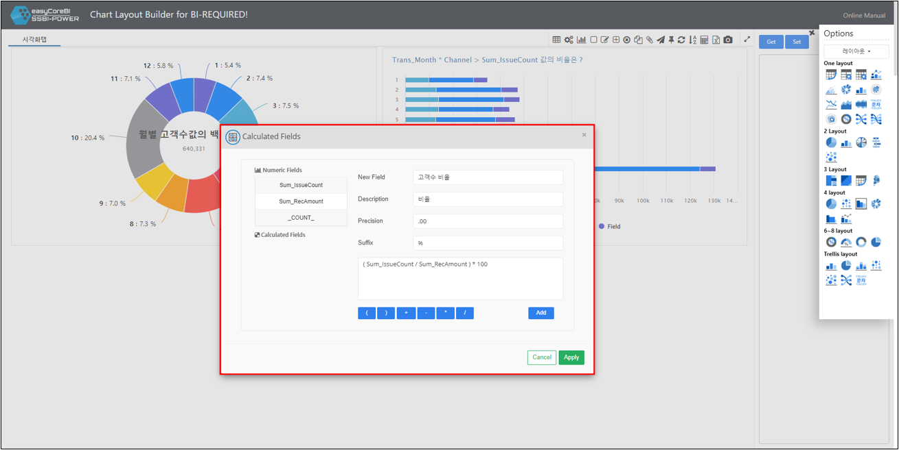

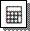계산값 필드 : 리포트에 계산필드를 추가할 수 있는 기능입니다.

1. 생성된 쿼리의 숫자형 필드 목록 
2. 새로 생성할 계산필드 이름 
3. 새로 생성할 계산필드 설명 
4. 표시할 소수점 자릿수 설정 
5. 표시할 단위 ( $ 등의 접미사 ) 설정 
6. 사용할 계산식 입력 
7. 마우스 클릭으로 기호 사용 

 

### 11. 내보내기

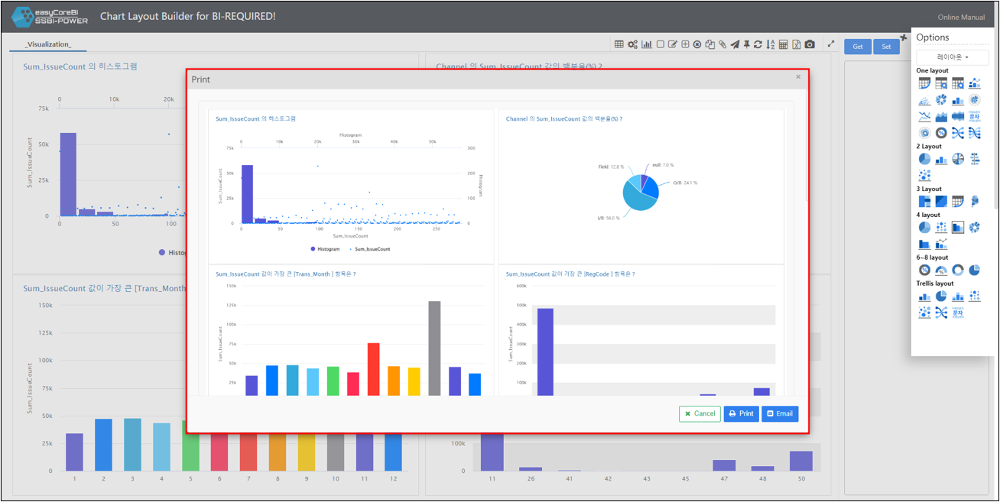

   : 생성한 리포트를 인쇄할 수 있고, 이메일로 내보낼 수 있습니다.

1. 인쇄하기
2. 이메일로 시각화 자료 전송

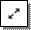   : 시각화 대시보드를 전체화면 확대 / 축소 할 수 있습니다.
