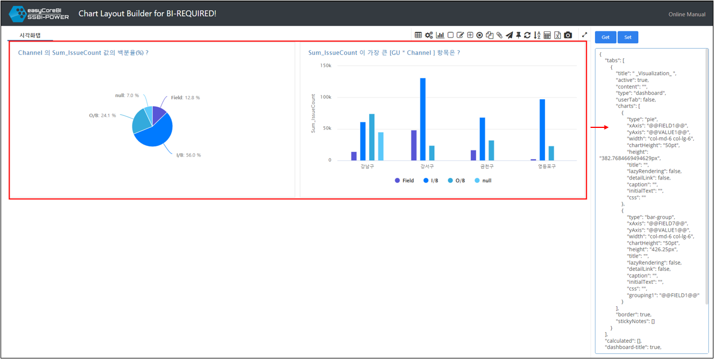

# Layout Builder 활용하기

<br>

Layout Builder 를 활용하여 추출한 JSON 형태의 차트레이아웃을 **"BI-REQUIRED"** 에 적용시켜 사용하는 방법을 간단히 알아 보겠습니다.

<br> 


<p align="center"><font size="2m">간단한 파이차트와, 그룹바차트를 만들고 Get 버튼 클릭!</font></p>

**"BI-REQUIRED"**에 사용하고 싶은 차트를 사용자화 합니다.

Get 버튼을 눌러 추출한 레이아웃 코드는 아래 코드블럭처럼 JSON 형태입니다.

``` json
{
    "tabs": [
        {
            "title": " _Visualization_ ",
            "active": true,
            "content": "",
            "type": "dashboard",
            "userTab": false,
            "charts": [
                {
                    "type": "pie",
                    "xAxis": "@@FIELD1@@",
                    "yAxis": "@@VALUE1@@",
                    "width": "col-md-6 col-lg-6",
                    "chartHeight": "50pt",
                    "height": "382.7684669494629px",
                    "title": "",
                    "lazyRendering": false,
                    "detailLink": false,
                    "caption": "",
                    "initialText": "",
                    "css": ""
                },
                {
                    "type": "bar-group",
                    "xAxis": "@@FIELD7@@",
                    "yAxis": "@@VALUE1@@",
                    "width": "col-md-6 col-lg-6",
                    "chartHeight": "50pt",
                    "height": "426.25px",
                    "title": "",
                    "lazyRendering": false,
                    "detailLink": false,
                    "caption": "",
                    "initialText": "",
                    "css": "",
                    "grouping1": "@@FIELD1@@"
                }
            ],
            "border": true,
            "stickyNotes": []
        }
    ],
    "calculated": [],
    "dashboard-title": true,
    "column_sorting": [],
    "layout": "3_way_histogram.json",
    "theme": {
        "name": "IOS",
        "css": "ios.css",
        "chart": "ios.txt"
    }
}
```

